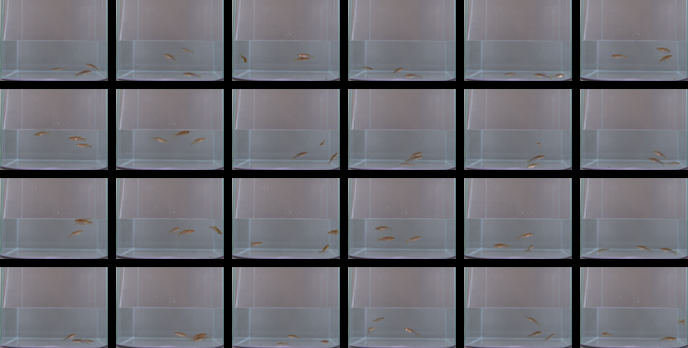
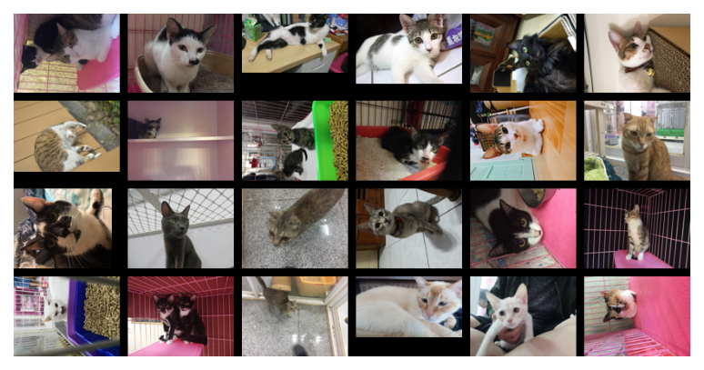
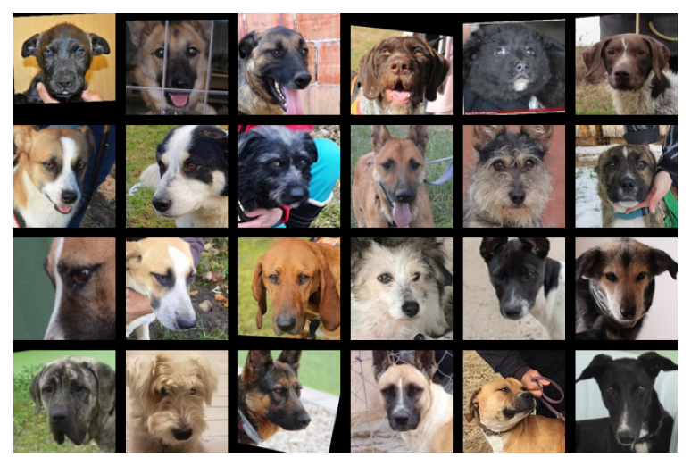
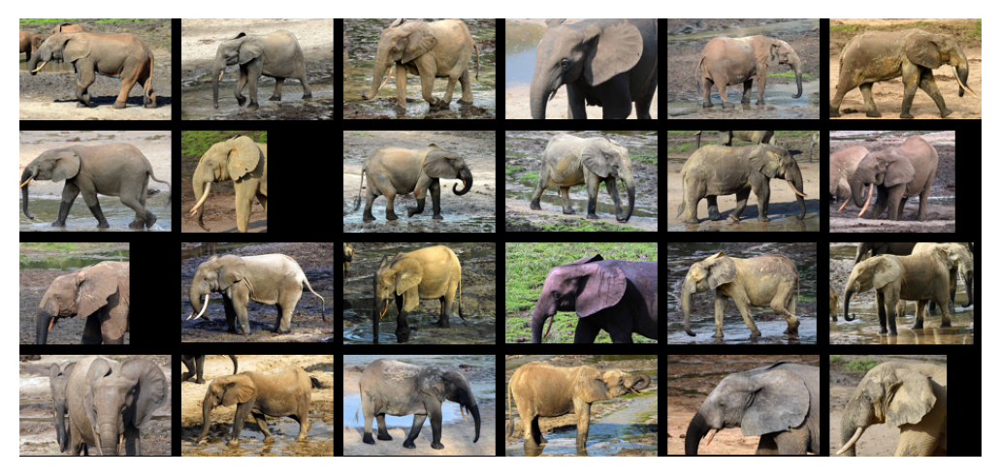
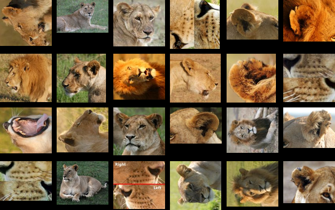
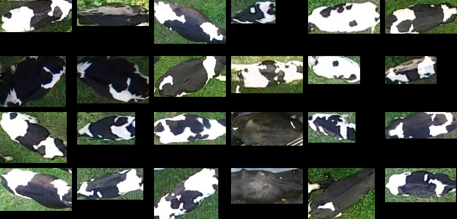
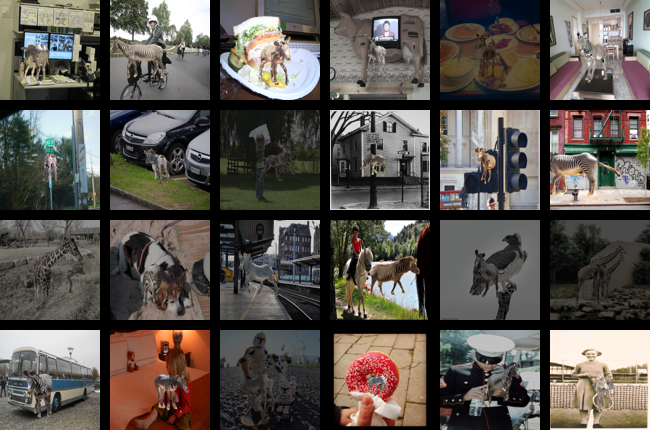

## AAUZebraFish

Three zebrafish were placed in a small clear glass tank and a video was captured. The authors used a careful setup to ensure that the fish are approximately the same distance from the camera and that the lightning conditions are good. Frames were extracted and the three fish were manually tracked by providing bounding boxes. This was repeated two times with two different sets of fish, resulting of images of six fish in total.

## AerialCattle2017

Datasets AerialCattle2017, Cows2021, FriesianCattle2015, FriesianCattle2017 and OpenCows2020 were created by one group. They capture Holstein-Friesian cows from an aerial standpoint. All images were extracted from videos. FriesianCattle2015 and FriesianCattle2017 were obtained filming cows exiting a milking file. AerialCattle2017 was captured by a drone in an outdoor agricultural field environment. OpenCows2020 combines these datasets. Since the distance of the camera ranges from approximately 4m (FriesianCattle2015) to 25m (AerialCattle2017), it is relatively easy to separate these datasets. Moreover, no individual cow seems to be present in both image acquisitions. Cows2021 depicts the cows in a similar way as FriesianCattle2015, when the camera pointed downwards from 4m above the ground over a walkway between milking parlour and holding pens. Some of the datasets are provided with videos and besides cow re-identification they also aim at cow detection and localization.

## AmvrokikosTurtles

This dataset consists of photographs of Mediterranean loggerhead sea turtles taken at Amvrakikos Gulf, Greece (39°02'N, 21°06'E) which is wellknown foraging site for adult and juvenile turtles. Photographs were collected as part of a long-term capture-mark-recapture project conducted by ARCHELON, the Sea Turtle Protection Society of Greece. Turtles were captured from a boat using the sea turtle rodeo technique and among other data collected, photographs of the head sides were taken while the animal was on the boat. In all photographs, either the whole side of the head was fully shaded or fully illuminated by the sun. All photographs in this dataset were taken during the summer months (June-August) between 2014 and 2022, using a selection of different digital cameras of varying optical resolution.

## ATRW

The ATRW (Amur Tiger Re-identification in the Wild) dataset was collected with the help of WWF in ten zoos in China. The images were extracted from videos. Besides tiger re-identification, the dataset can also be used for tiger detection and pose estimation.

## BelugaID

The high-quality datasets BelugaID, HyenaID2022 and LeopardID2022 were published by WildMe. They contain labelled images of beluga whales, heynas and leopards. BelugaID represents a collaborative effort based on the data collection and population modeling efforts conducted in the Cook Inlet off the cost of Alaska from 2016-2019. HyenaID2022 and LeopardID2022 represent a collaborative effort based on the data collection and population modeling efforts conducted by the Botswana Predator Conservation Trust. BelugaID contains pre-cropped high-quality images taken mostly from the top. On the other hand, HyenaID2022 and LeopardID2022 contain both day-time and night-time photos with largely various quality. In some photos, it is even difficult to spot the corresponding animal. The latter two datasets are annotated with viewpoints and bounding boxes.

## BirdIndividualID

BirdIndividualID is a collection of three separate bird datasets: sociable weavers at Benfontein Nature Reserve in Kimberley, South Africa, wild great tits in Möggingen, Germany and captive zebra finches at the same place. The individuals of sociable weavers and great tits were fitted with PIT-tags as nestlings, or when trapped in mist-nets as adults. The collection of labelled pictures in the wild was automated by combining RFID technology, single-board computers (Raspberry Pi), Pi cameras and artificial feeders. The authors fitted RFID antenna to small perches placed in front of bird feeders filled with seeds. The RFID data logger was then directly connected to a Raspberry Pi with a camera. When the RFID data logger detected a bird, it sent the individual's PIT-tag code to the Raspberry Pi, which took a picture. The cages of captive zebra finches were divided into equally sized partitions with a net, allowing us to take pictures from individual birds without completely socially isolating them. Besides the full images, they provided segmentated images of all birds. This is the only dataset, where authors admitted that part of the labels are wrong. This stemmed from the automatic procedure of labelling, where multiple birds sometimes entered the artificial feeder and the camera took a picture of the wrong bird. They manually checked the sociable weaver images and 4.4% images were confirmed to be mislabelled.

## CatIndividualImages

The images were acquired using regular digital cameras or smartphones. The resolutions of the images ranged between 195 x 261 and 4608 x 3453 pixels. Most images of cats were acquired at public animal shelters (Taipei City Animal Protection Office, Taipei, Taiwan; and New Taipei City Government Animal Protection and Health Inspection Office, New Taipei, Taiwan) and private animal shelters in Taipei. The remaining images were collected from social media.

## CTai

CTai and CZoo datasets contain cropped chimpanzee faces. CZoo originates from a collaboration of the authors with animal researchers in Leipzig. Provided images are of high quality, are well exposed, and are taken without strong blurring artifacts. The images are complemented by biologically meaningful keypoints (centers of eyes, mouth, and earlobes) together with information about age and gender. CTai consists of recordings of chimpanzees living in the Taï National Park in Côte d'Ivoire. The image quality differs heavily and the annotation quality of additional information is not as high as for CZoo. CTai contains typos in six individuals (such as Woodstiock instead of the correct Woodstock), which we corrected. The unknown individuals were labelled as *Adult*, which we fixed as well.

## CZoo

See the description in [CTai](#ctai).

## CowDataset

The dataset does not contain any description.

## Cows2021

See the description in [AerialCattle2017](#aerialcattle2017).

## DogFaceNet

The dataset does not contain any description about its acquisition, only factual description of images.

## Drosophila

Twenty drosophila flies were collected few hours after eclosion and housed separately. On the third day, post-eclosion flies were individually mouth pipetted into a circular acrylic arena, illuminated with overhead LED bulbs and filmed in grayscale. This was repeated in three consecutive days. Since the sampling frequency from videos was high, this generated several million images. However, the differences between these images are small.

## ELPephants

This elephant dataset was provided by researchers from the Elephant Listening Project (ELP) at the Cornell University Ithaca, who are conducting research on forest elephants visiting the Dzanga bai clearing in the Dzanga-Ndoki National Park in the Central African Republic. It was devised for re-identification of elephants that have been documented before. The images have been taken over a range of about 15 years.

## FriesianCattle2015

See the description in [AerialCattle2017](#aerialcattle2017).

## FriesianCattle2017

See the description in [AerialCattle2017](#aerialcattle2017).

## GiraffeZebraID

GiraffeZebraID contains images of plains zebra and Masai giraffe taken from a two-day census of Nairobi National Park with the participation of 27 different teams of citizen scientists and 55 total photographers. The photographers were recruited both from civic groups and by asking for volunteers at the entrance gate in Nairobi National Park. All volunteers were briefly trained in a collection protocol and tasked to take pictures of animals within specific regions and from specific viewpoints. These regions helped to enforce better coverage and prevent a particular area from becoming oversampled. Only images containing either zebras or giraffes were included in this dataset. All images are labeled with viewpoints and possibly rotated bounding boxes around the individual animals. All of the images in the dataset have been resized to have a maximum dimension of 3,000 pixels.

## Giraffes

## HappyWhale

HappyWhale, HumpbackWhale and NOAARightWhale are datasets of various whale species. They are a product of multi-year collaboration of multiple research institutions and citizen scientists. All these datasets were released as Kaggle competitions to make it easy and rewarding for the public to participate in science by building innovative tools to engage anyone interested in marine mammals. The whales were photographed during aerial surveys. HumpbackWhale is the most uniform dataset with a clear view on the whale tail above water. NOAARightWhale contains images of submerging whales. HappyWhale is the most diverse dataset with images of dorsal fins. Some image contain only the dorsal fin, while others contain a significant part of the whale body.

## HumpbackWhaleID

See the description in [HappyWhale](#happywhale).

## HyenaID2022

See the description in [BelugaID](#belugaid).

## IPanda50

The authors collected giant panda streaming videos from the Panda Channel, which contains daily routine videos of pandas at different ages. The identity annotations are provided by professional zookeepers and breeders. The authors manually selected images with various illuminations, viewpoints, postures, and occlusions. In addition, they manually cropped out each individual panda with a tight bounding box and provided additional eye annotations.

## LeopardID2022

See the description in [BelugaID](#belugaid).

## LionData

LionData and NyalaData contain images of lions and nyalas collected from Mara Masia project in Kenya. While images in NyalaData are relatively uniform nad show the image of the whole nyalas, LionData depict various lion details such as ears or noses.

## MacaqueFaces

MacaqueFaces shows the faces of group-housed rhesus macaques at a breeding facility in large indoor enclosures. To allow the care staff to identify individuals, the animals at the colony the monkeys were tattooed with an abbreviation of their ID on their chests. High definition video footage was collected. Each video was annotated with the date and group information. Faces were semi-automatically extracted from videos and random frames were selected for each individual. Only adults were included as the facial features of infants changed substantially over the one year filming period. 

## MPDD

MPDD is a dataset of various dog breeds with 1657 images of 192 dogs. The dataset should be theoretically simple than most because the dogs differ significantly in size and color. 

## NDD20

The Northumberland Dolphin Dataset 2020 (NDD20), is a challenging image dataset as in contains both above and under water photos of two dolphin species taken between 2011 and 2018. The datasets contains both images taken both above and below water. Below water collection efforts consisted of 36 opportunistic surveys of the Farne Deeps. Above water efforts consisted of 27 surveys along a stretch of the Northumberland coast. Above water photographs were taken using a camera from the deck of a small rigid inflatable boat on days of fair weather and good sea conditions. Below water images are screen grabs from high-definition video footage taken with cameras again under good sea conditions. Individuals in the above water images are identified using the structure of the dolphin's dorsal fin. Below water images are less common, but provide additional features for identification such as general colouring, unique body markings, scarring and patterns formed by injury or skin disease. The images contains multiple annotations including dolphin species and approximately 14\% of above water images contain segmentation mask for the dolphin fin.

## NOAARightWhale

See the description in [HappyWhale](#happywhale).

## NyalaData

See the description in [LionData](#liondata).

## OpenCows2020

See the description in [AerialCattle2017](#aerialcattle2017).

## PolarBearVidID

PolarBearVidID is a dataset of 13 individual polar bears from 6 German zoos. The photos are extracted from 1431 video sequences at 12.5 fps totalling around 138 thousand images. Since the cameras were stationary, the background was cropped to prevent background overfitting.

## ReunionTurtles

This dataset consists of photographs taken between 2007 and 2024 on Reunion Island, a French territory in the Indian Ocean (21°0'S, 55°30'E), whose shallow waters are known to be a development and foraging ground for green and hawksbill turtles. Photographs were taken by recreational divers as part of a citizen science programme with no specific associated protocols (no specific viewing angle or distance). Citizens shared their photographs whenever they wished with scientists for further analysis. All photographs are turtle head profiles taken during the same encounter and are stored in the TORSOOI database.

## SealID

SealID is a Saimaa ringed seals database from the Lake Saimaa in Finland. The data were collected annually during the Saimaa ringed seal molting season from 2010 to 2019 by both ordinary digital cameras during boat surveys and game camera traps. The GPS coordinates, the observation times, and the numbers of the seals were noted.  Seal images were matched by an expert using individually characteristic fur patterns. The dataset contains patches and syandard images. Patches show small patterned body parts which are sufficient for seal identification. Standard images are presented both as full images and their segmented version with seal only and black background.

## SeaStarReID2023

This dataset contains 1204 images of 39 individual Asterias rubens sea stars and 983 images of 56 individual Anthenea australiae sea stars. For the ASRU data set, images were taken on five distinct days. For the ANAU data set, images were taken in three locations (sunlight, shaded, naturalistic exhibit) on the same day. The photos were taken in a water tank.

## SeaTurtleID2022

SeaTurtleID is a novel large-scale dataset of Mediterranean loggerhead sea turtles. These turtles are well-suited to photo-identification due to their unique scale patterns, which can be used to identify individual turtles and remain stable throughout their lives. These patterns are found on the lateral and dorsal sides of the turtle's head and differ between the left and right sides of the same turtle. 
 
The dataset contains photographs continuously captured over 12 years, from 2010 to 2021. With 7774 photographs and 400 individuals, the dataset represents the most extensive publicly available dataset for sea turtle identification in the wild. The images are uncropped, with various backgrounds and each have time stamp of capture. Approximately 90% of photographs have size 5472×3648 pixels, the average photograph size is 5289×3546 pixels, while the head occupies on average 639×551 pixels. The photographs were captured using three different cameras with various accessories and taken from various distances at depths ranging from 1 to 8 meters, with most taken at less than 5 meters deep.

The annotation of individual identities for the SeaTurtleID dataset was done manually by an experienced curator and validated by automatic reidentification methods. Head segmentation masks and corresponding bounding boxes were generated using a combination of manual and machine annotation.

## SMALST

SMALST is a unique dataset because it does not contain images of real animals. Instead, the authors used the SMALR method to render 3D models of artificial Grevy's zebras from real zebra images. Then they used projections to generate multiple zebra images from each 3D model. Finally, they put the generated image on some background images. The advantages of this approach are the possibility to generate infinite numbre of images and to have precise segmentations for free. The disadvantage is that the images are computer-generated and placed in non-real background.

## StripeSpotter

StripeSpotter is the first published dataset. For seven consecutive days, the authors made a semi-random circuit through the 90,000 acre nature conservancy Ol'Pejeta Conservancy in Laikipia, which contains several hundred wild Plains zebras, and fewer than 20 endangered Grevy's zebras. Two people were stationed on top of the vehicle to take pictures with cheap digital cameras while the driver circled around individual groups of zebras, so as to capture both flanks of the animal. We collected as many pictures as possible of each flank of an animal in different positions in its natural walking gait. A professionally trained field assistant identified the images based on a database of prior sightings stretching back almost ten years. All but a few zebras were reliably identified. 

## WhaleSharkID

WhaleSharkID contains images of whale sharks and represents a collaborative effort based on the data collection and population modeling efforts conducted at Ningaloo Marine Park in Western Australia from 1995 to 2008. Images are annotated with bounding boxes around each visible whale shark and viewpoints.

## ZakynthosTurtles

See the description in [SeaTurtleID2022](#seaturtleid2022).

## ZindiTurtleRecall

ZindiTurtleRecall was collected through the Watamu Turtle Watch and Local Ocean Conservation. Many of the turtles in this project are turtles who have been caught as bycatch by fishermen and bought to Local Ocean Conservation for rehabilitation. Each rescued turtle is assessed, then measured, weighed and tagged. If it is in good health, the turtle is transported to the Watamu Marine National Park where it is released back into the ocean. Severely injured turtles are admitted to a rehabilitation unit. The dataset contain close-up images of turtle eays and post-ocular scutes from three different viewpoints. 

