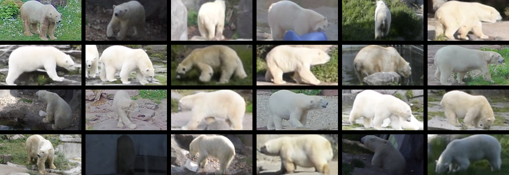
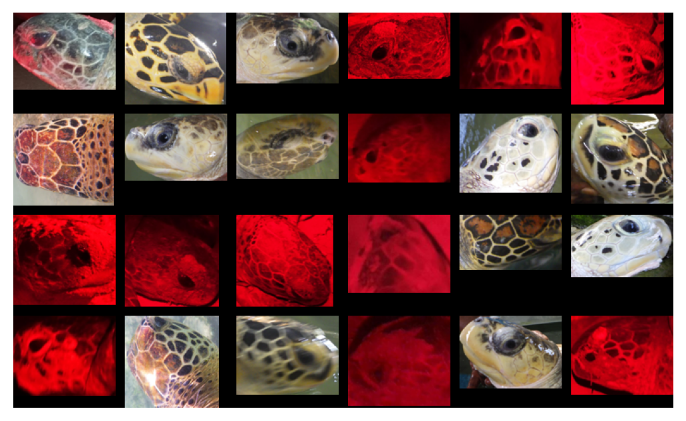

```python exec="true" session="run" keep_print="True"
from wildlife_datasets import datasets

def print_list(xs):
    for x in xs:
        print(x)

def print_list_red(xs):
    for x in xs:
        print(str(x)[8:-2])
```


# Recommended datasets 

The package handles a large number of datasets. Even though it is possible to test developed methods on all these datasets, some combinations make more sense. We export several possible combinations. Before testing methods, the datasets need to be [downloaded](./tutorial_datasets.md#downloading-datasets).


## Small datasets

We grouped all datasets which download size is smaller than 1GB. These are often cropped and can be used for relatively quick testing of developed methods. We recommend this group or its subset as a starting point.

```python exec="true" source="above" result="console" session="run"
datasets.names_small

print_list_red(datasets.names_small) # markdown-exec: hide
```





## Wild datasets

The wild datasets are usually the most difficult one containing uncropped image (often bounding boxes are provided though) of animals in their natural habitat. None of the dataset is extracted from video (unlike many datasets taken in controlled environments) and animals are depicted from multiple poses and distances.

```python exec="true" source="above" result="console" session="run"
datasets.names_wild

print_list_red(datasets.names_wild) # markdown-exec: hide
```


## Transfer learning

The package handles multiple different datasets of the same or similar animal species. Then it is natural to train a method on one dataset and evaluate the performance on another dataset. 


### Sea turtles

There are two sea turtle datasets. While SeaTurtleIDHeads (or its uncropped version SeaTurtleID) contains loggerhead turtles, ZindiTurtleRecall shows green turtles.

```python exec="true" source="above" result="console" session="run"
datasets.names_turtles

print_list_red(datasets.names_turtles) # markdown-exec: hide
```





### Cows

Multiple dataset show the Friesian cows. While all these datasets besides `CowDataset` were captured at one place, they show the cows in different settings.

```python exec="true" source="above" result="console" session="run"
datasets.names_cows

print_list_red(datasets.names_cows) # markdown-exec: hide
```


### Dogs

Two datasets show images of various dog breeds.

```python exec="true" source="above" result="console" session="run"
datasets.names_dogs

print_list_red(datasets.names_dogs) # markdown-exec: hide
```


### Giraffes

There are four datasets with zebras. GiraffeZebraID contains both giraffes and zebras and StripeSpotter is the oldest public wildlife dataset. The other two datasets pose certain issues, namely, Giraffes is automatically labelled by Hotspotter (there is no guarantee of the label correctness), SMALST does not depict real animals but generated images from 3D models (based on real animals). 

```python exec="true" source="above" result="console" session="run"
datasets.names_giraffes

print_list_red(datasets.names_giraffes) # markdown-exec: hide
```


### Primates

The datasets CTai, CZoo and MacaqueFaces are very similar, all containing a relatively low resolution head images of chimpanzees (CTai and CZoo) or macaques (MacaqueFaces).

```python exec="true" source="above" result="console" session="run"
datasets.names_primates

print_list_red(datasets.names_primates) # markdown-exec: hide
```


### Whales, dolphins and sharks

We group these three relatively distant mammals into one group because they can all be recognize by their fin shape. The group for transfer learning will be probably the most difficult because it contains various animals takes from various poses. BelugaID is a dataset of beluga whales taken from the top, while HumpbackWhaleID contain images of the tail fin of humpback whales. HappyWhale combines both these poses. NOAARightWhale is a dataset of right whales taken from a relatively large distance. The last two datasets do not depict whales. While NDD20 is a dataset of dolphins, WhaleSharkID is a dataset of whale sharks.

```python exec="true" source="above" result="console" session="run"
datasets.names_whales

print_list_red(datasets.names_whales) # markdown-exec: hide
```


## Segmentated datasets

For researchers interested in the role of segmentation, multiple datasets have segmented and non-segmented version. These include BirdIndividualID, SealID, SeaTurtleID and SMALST.

## Problematic datasets

There are a few datasets which we recommend not to use. AAUZebraFish is more of a tracking dataset. Drosophila contains a huge number of fly images extracted from videos. LionData contain only a few images of each lion; moreover, most of the images contain only a small part of the lion (such as an ear).


